University: [ITMO University](https://itmo.ru/ru/)

Faculty: [FICT](https://fict.itmo.ru)

Course: [Introduction to distributed technologies](https://github.com/itmo-ict-faculty/introduction-to-distributed-technologies)

Year: 2022/2023

Group: K4113c

Author: Goncalves Manuel

Lab: Lab2

Date of create: 24.11.2022

Date of finished: 3.12.2022

# Лабораторная работа №4 "Сети связи в Minikube, CNI и CoreDNS"

### Creating a minikube cluster with 2 nodes and install the CNI=calico plugin
```
minikube start --network-plugin=cni --cni=calico --nodes 2 --kubernetes-version=v1.24.0
```
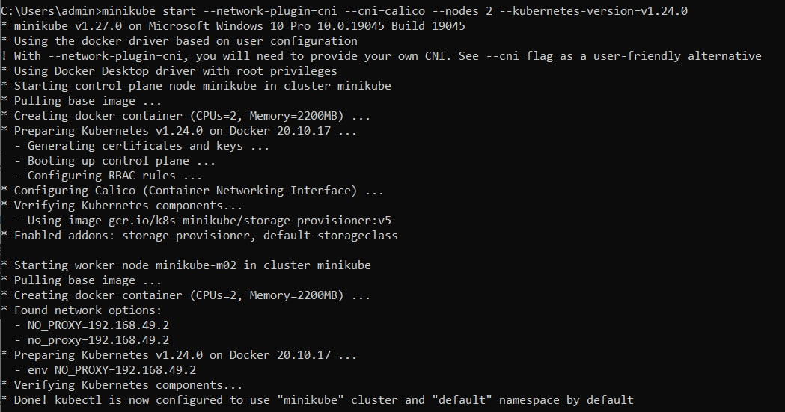

### Get the list of created nodes:
```
minikube kubectl -- get nodes
```
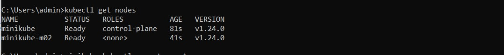
### The status of the nodes can be found using the following command:

`minikube status -p minikube`

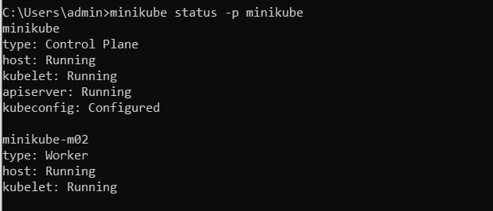

Deploy calicoctl pod

`kubectl apply -f calicoctl.yaml`

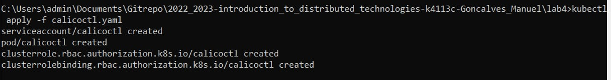

### Set labels for nodes
```
kubectl label nodes minikube zone=west
kubectl label nodes minikube-m02 zone=east
```
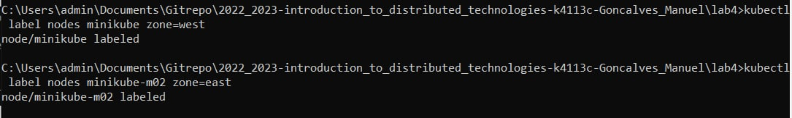

### Creating an ip pool, remove the default pool:
```
kubectl exec -i -n kube-system calicoctl -- /calicoctl create -f - < ip_pool.yaml
kubectl exec -i -n kube-system calicoctl -- /calicoctl  delete ippools default-ipv4-ippool
kubectl exec -i -n kube-system calicoctl -- /calicoctl  get ippools -o wide
```
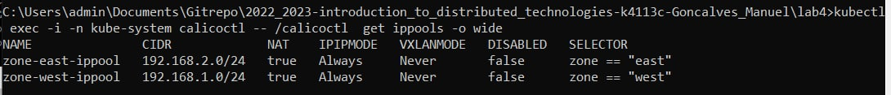

Let's creating resources, a service, a config map.
`kubectl apply -f resources.yaml`
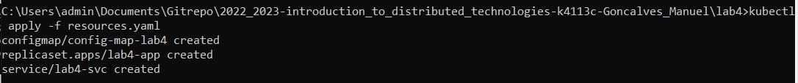

### Check out the IP addresses of our pods.
`kubectl get pods -o wide`

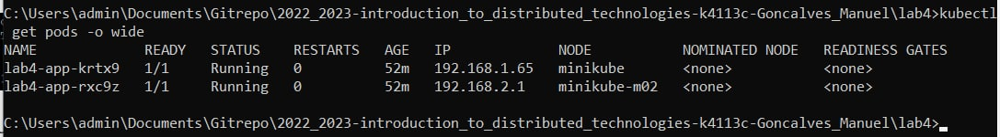

### Result 

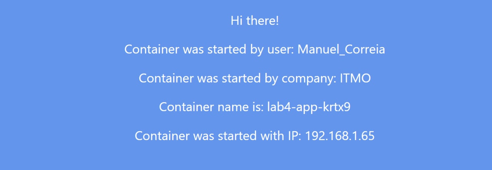

### Ping test
`kubectl exec -it lab4-app-krtx9  -- ping -c4 192.168.2.1`

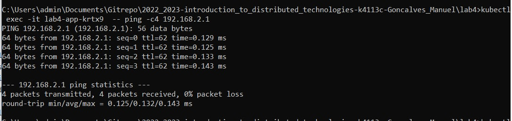

### Схема
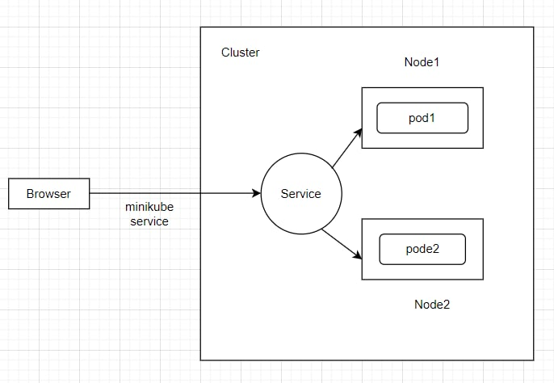
