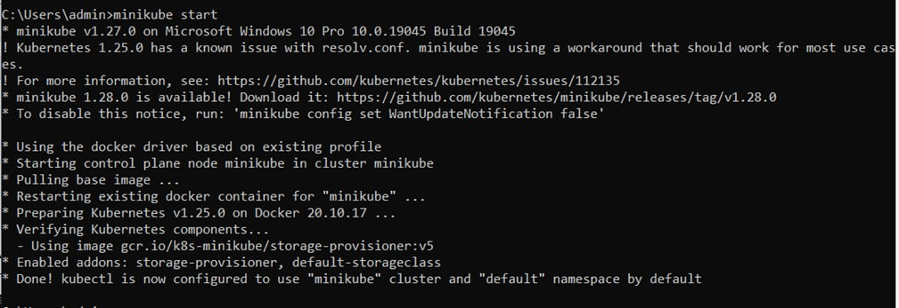
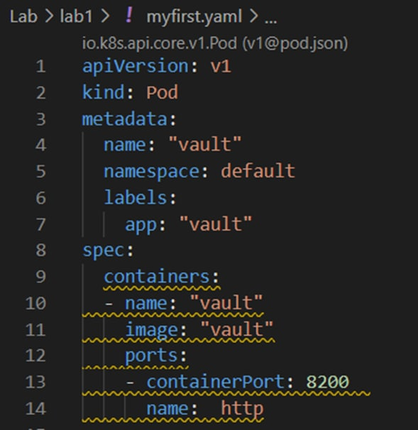
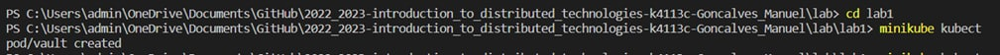
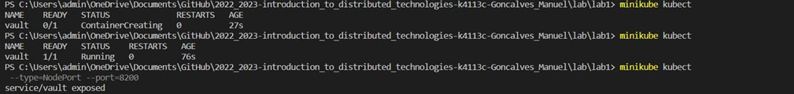
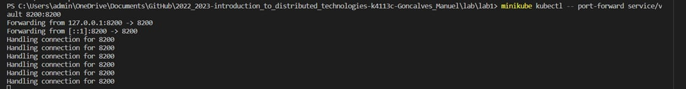
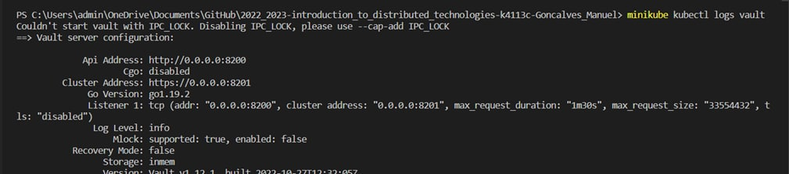
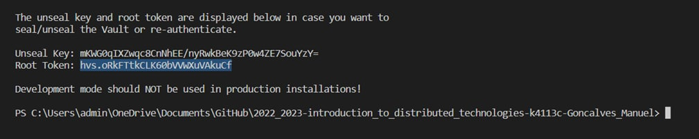
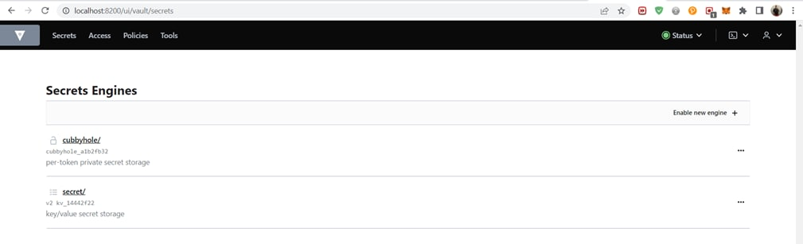
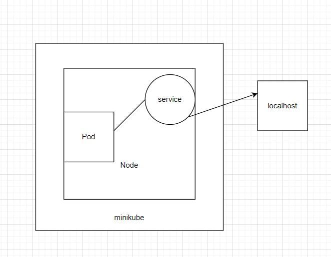

University: [ITMO University](https://itmo.ru/ru/)

Faculty: [FICT](https://fict.itmo.ru)

Course: [Introduction to distributed technologies](https://github.com/itmo-ict-faculty/introduction-to-distributed-technologies)

Year: 2022/2023

Group: K4113c

Author: Goncalves Manuel

Lab: Lab1

Date of create: 20.10.2022

Date of finished: 17.11.2022

minikube start process
```
minikube start
```



writing a manifest to deploy a HashiCorp Vault "pod"



We create a port on the yaml file
```
minikube kubectl apply –f myfirst.yaml
```



Create a service to access this container
run the command: 
```
minikube kubectl -- expose pod vault --type=NodePort --port=8200
```



The service has been created, now let's access the container
```
minikube kubectl -- port-forward service/vault 8200:8200
```




Using command `kubectl logs vault` then find root token in logs.

Minikube will forward the computer port to the container and we can access the vault using the link http://localhost:8200


Схема организации контейеров и сервисов 


