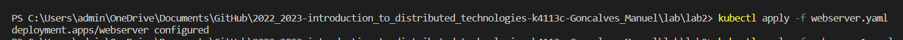
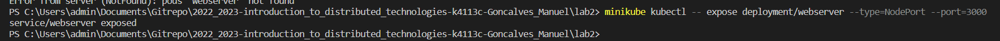
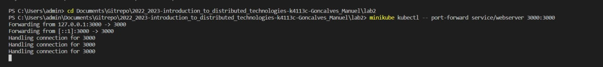
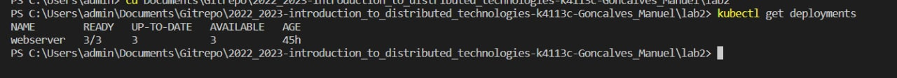
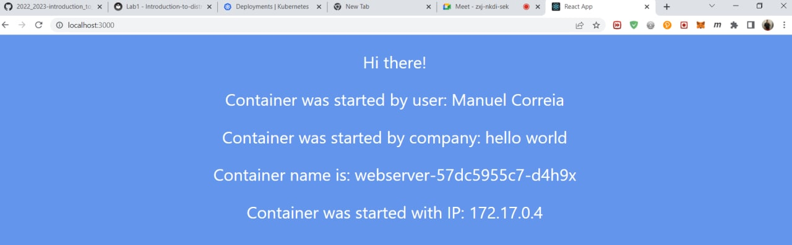

University: [ITMO University](https://itmo.ru/ru/)

Faculty: [FICT](https://fict.itmo.ru)

Course: [Introduction to distributed technologies](https://github.com/itmo-ict-faculty/introduction-to-distributed-technologies)

Year: 2022/2023

Group: K4113c

Author: Goncalves Manuel

Lab: Lab2

Date of create: 17.11.2022

Date of finished: 19.11.2022

## Creating a deployment manifest
[deployment manifest](https://github.com/ManuelCorreia97/2022_2023-introduction_to_distributed_technologies-k4113c-Goncalves_Manuel/blob/main/lab2/webserver.yaml)
```
kubectl apply -f webserver.yaml
```


### Creating a service.
[Manifest](https://github.com/ManuelCorreia97/2022_2023-introduction_to_distributed_technologies-k4113c-Goncalves_Manuel/blob/main/lab2/webserver1.yaml)

### Creating a service through which we will have access to these "pods".

`minikube kubectl -- expose deployment/webserver --type=NodePort --port=3000`



Opening a port to access the service using the following command:

`minikube kubectl -- port-forward service/webserver 3000:30000`



Run `kubectl get deployments` to check if the Deployment was created.



## When inspect the Deployments in cluster, the following fields are displayed:
* NAME lists the names of the Deployments in the namespace;
* READY displays how many replicas of the application are available to your users. It follows the pattern ready/desired;
* UP-TO-DATE displays the number of replicas that have been updated to achieve the desired state;
* AVAILABLE displays how many replicas of the application are available to your users;
* AGE displays the amount of time that the application has been running.

## Result 
Now, we can access to website via link [http://localhost:3000](http://localhost:3000/)



