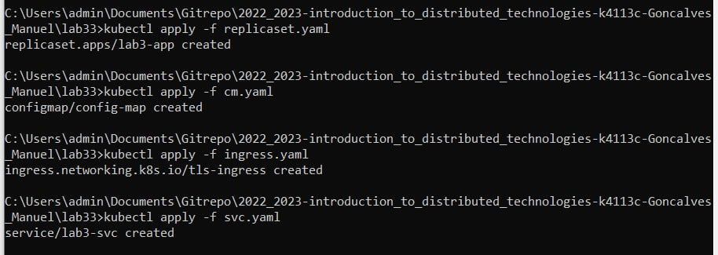
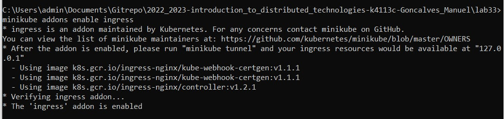
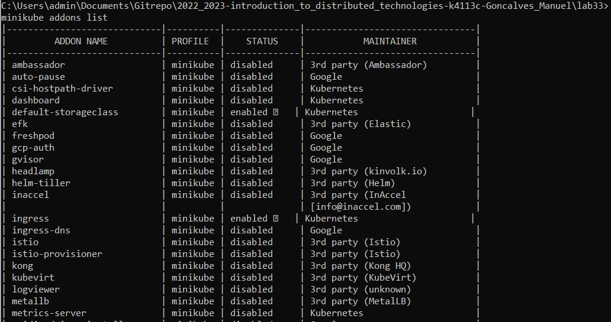
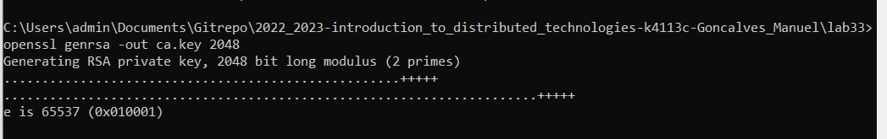
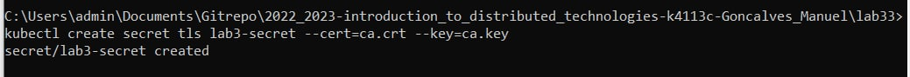
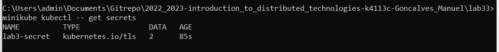
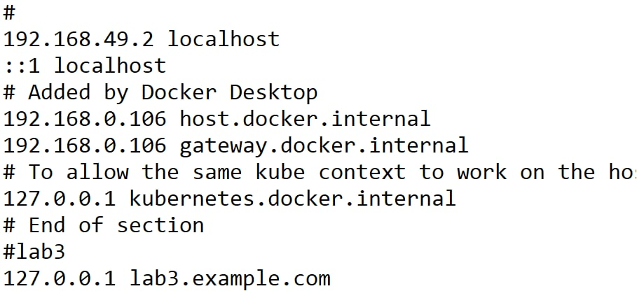
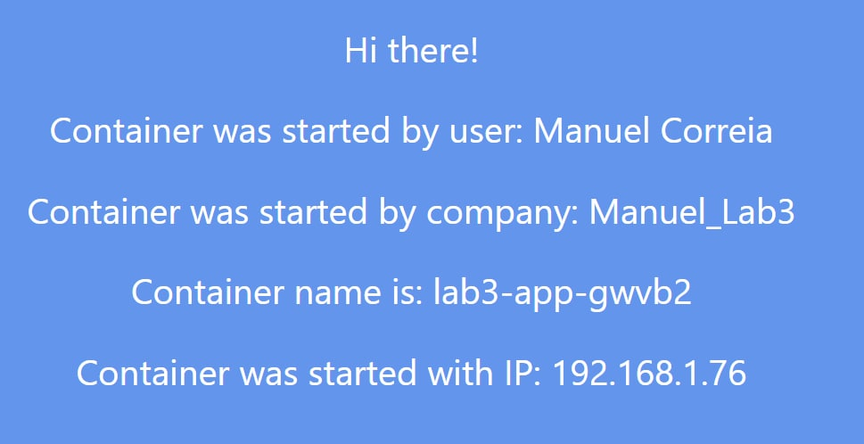
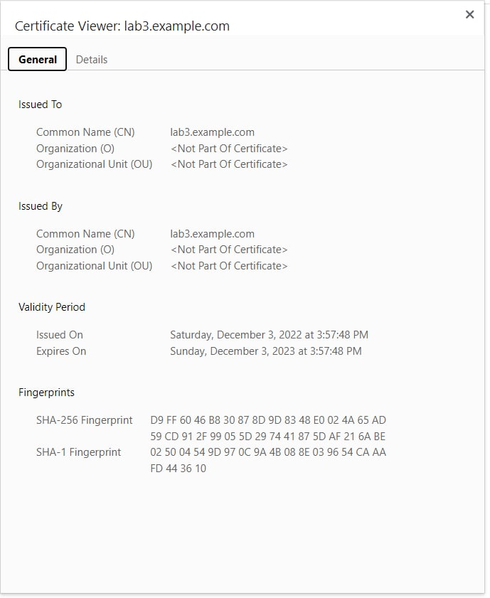
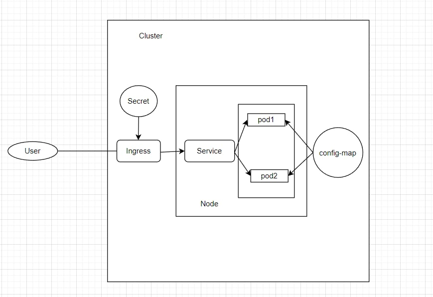

University: [ITMO University](https://itmo.ru/ru/)

Faculty: [FICT](https://fict.itmo.ru)

Course: [Introduction to distributed technologies](https://github.com/itmo-ict-faculty/introduction-to-distributed-technologies)

Year: 2022/2023

Group: K4113c

Author: Goncalves Manuel

Lab: Lab2

Date of create: 17.11.2022

Date of finished: . .2022

# Лабораторная работа №3 "Сертификаты и "секреты" в Minikube, безопасное хранение данных."

## Creating a service, ingress, replicaset file and execute the command:
```
kubectl apply -f cm.yaml
kubectl apply -f replicaset.yaml 
kubectl apply -f svc.yaml 
kubectl apply -f ingress.yaml 
```   
## or 
`kubectl apply -f cm.yaml -f replicaset.yaml -f svc.yaml -f ingress.yaml `



## Enabling ingress addons:
```
minikube addons enable ingress   
```


### Checking that ingress is enabled
`minikube addons list`



## Generate and import of the TLS certificate to minikube
```
openssl genrsa -out ca.key 2048
openssl req -x509 -new -nodes -days 365 -key ca.key -out ca.crt -subj "/CN=lab3.example.com"
```


## Importing of the certivicate to minikube
```
kubectl create secret tls lab3-secret --cert=ca.crt --key=ca.key
```



## Editing hosts


## Results

### Checking the certificate


## Scheme
